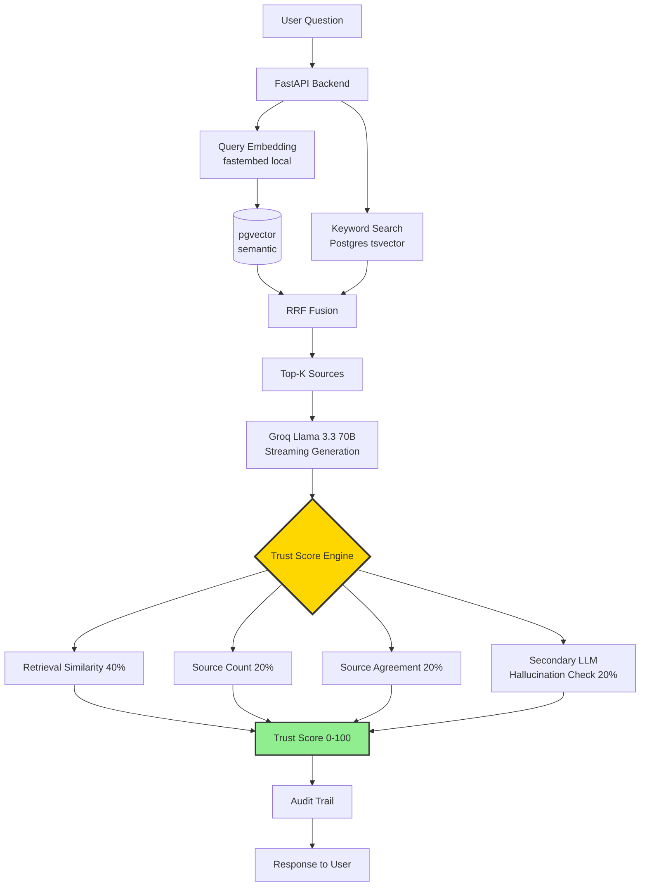

<h1 align="center">TrustRAG</h1>

<p align="center">
  <b>AI-powered document Q&A with built-in trust verification.</b><br>
  <i>Because confidence matters when AI answers your business questions.</i>
</p>

<p align="center">
  <a href="#quick-start">Quick Start</a> &bull;
  <a href="#architecture">Architecture</a> &bull;
  <a href="#benchmarks">Benchmarks</a> &bull;
  <a href="#ecosystem">Ecosystem</a>
</p>

<p align="center">
  
  
  
  
  <a href="https://pypi.org/project/trustrag-langchain/"></a>
  <a href="https://pypi.org/project/trustrag-mcp/"></a>
  <a href="https://pypi.org/project/trustrag-eval/"></a>
</p>

---

## Demo


*Real-time WebSocket streaming with multi-stage status: retrieve → generate → verify trust.*

---

## The Problem

Generic AI chatbots confidently make up facts. For business-critical use cases — compliance,
safety documentation, internal knowledge bases — this "hallucination" is a dealbreaker.

Existing RAG solutions retrieve relevant docs, but still **blindly trust the LLM's output**.

## The Solution

TrustRAG ships with a **4-factor Trust Score** that tells users *why* each answer is (or isn't) reliable.

| Factor | Weight | What it catches |
|--------|--------|-----------------|
| **Retrieval Similarity** | 40% | Is the source actually relevant? |
| **Source Count** | 20% | Is the answer backed by multiple sources? |
| **Source Agreement** | 20% | Do sources agree with each other? |
| **Hallucination Check** | 20% | Does a second LLM agree the answer is grounded? |

Every answer ships with:
- **0-100 confidence score**
- **Source tracing** down to page/paragraph
- **3-pass consistency check**
- **Secondary-LLM hallucination verification**
- **Full audit trail**

## Architecture



## Live Demo

- **Frontend**: https://trustrag.vercel.app
- **Backend**: https://trustrag-production.up.railway.app
- **Health probe**: `/health` (HEAD + GET both 200)

Pipeline runs Llama 3.3 70B Versatile via Groq, with merged
self-check (HTTP path) and Postgres-backed query cache. Optimized to
**5-10s cache-miss / sub-300ms cache-hit** on Railway free tier
(1GB RAM, 0.5 vCPU) via embedding cleanup + cache + UptimeRobot keep-alive.
[Latency engineering details →](docs/superpowers/specs/2026-04-21-trustrag-v2-completion-design.md)

## Benchmarks

Measured 2026-04-23 on 15-query synthetic construction-safety subset
(5 semantic + 5 keyword + 5 hybrid). Pipeline ran on
`llama-3.1-8b-instant` due to 70B daily-quota exhaustion that day;
RAGAS judged by Groq 8B for free-tier-friendly throughput.

| Metric | Semantic-only | Hybrid (RRF k=60) | Δ |
|--------|--------------:|------------------:|--:|
| RAGAS Faithfulness | 0.241 | **0.377** | **+13.6pp ✓** |
| RAGAS Answer Relevancy | 0.729 | 0.596 | -13.3pp |
| RAGAS Context Precision | 0.128 | 0.101 | -2.7pp |
| RAGAS Context Recall | 0.377 | 0.273 | -10.4pp |
| Substring Match (overall) | 0.333 | **0.357** | **+2.4pp ✓** |
| ↳ Semantic-leaning q | 0.300 | **0.400** | **+10pp ✓** |
| ↳ Keyword-leaning q | 0.400 | 0.200 | -20pp |

**Honest read**: hybrid genuinely improves *faithfulness* (less
hallucination, +13.6pp) and *substring match on semantic queries*
(+10pp). Keyword-query degradation reflects 8B's difficulty
synthesizing from broader RRF retrieval — likely closes on 70B.
Sample is small (14-15q valid each side); deltas have ±5-10pp noise.

See [`docs/releases/v0.3.0-hybrid.md`](docs/releases/v0.3.0-hybrid.md)
for full methodology + raw JSONs in [`eval/results/`](eval/results/).

## Quick Start

```bash
git clone https://github.com/jigangz/trustrag
cd trustrag
cp .env.example .env
# Add your free Groq API key
docker compose up
# Frontend: http://localhost:5173
```

Uses:
- **Groq** (free tier) — Llama 3.3 70B for generation
- **fastembed** (local) — BAAI/bge-small-en-v1.5, no API key
- **pgvector + tsvector** (self-hosted Postgres)

**$0 to run.**

## Install as Package

```bash
# LangChain integration
pip install trustrag-langchain

# MCP server (for Claude Desktop / Cursor)
pip install trustrag-mcp

# Evaluation pipeline
pip install trustrag-eval
```

## Ecosystem

| Integration | Package | Status |
|-------------|---------|--------|
| **LangChain** (Retriever + Tool + LangGraph Agent w/ trust budget) | `trustrag-langchain` | [v0.1.0](https://pypi.org/project/trustrag-langchain/) |
| **MCP** (Claude Desktop, Cursor, Claude Code; 3 tools) | `trustrag-mcp` | [v0.1.1](https://pypi.org/project/trustrag-mcp/) |
| **RAGAS Eval Pipeline** (Groq + Gemini judge variants) | `trustrag-eval` | [v0.1.0](https://pypi.org/project/trustrag-eval/) |
| **n8n Workflow Templates** | [integrations/n8n/](integrations/n8n/) | 3 workflows |

### MCP in Claude Desktop


Three tools available end-to-end (verified in Claude Desktop against
production Railway):
- `trustrag_query` — knowledge base lookup with trust score + citations
- `trustrag_upload_document` — PDF ingestion to the backend
- `trustrag_get_audit_log` — fetch low-trust query history for review

Setup: add to `claude_desktop_config.json`:
```json
{
  "mcpServers": {
    "trustrag": {
      "command": "uvx",
      "args": ["trustrag-mcp"],
      "env": { "TRUSTRAG_BACKEND_URL": "https://trustrag-production.up.railway.app" }
    }
  }
}
```

See [`docs/releases/v0.5.0-mcp.md`](docs/releases/v0.5.0-mcp.md) for details.

## API Endpoints

| Method | Endpoint | Description |
|--------|----------|-------------|
| POST | `/api/documents/upload` | Upload and process a PDF |
| GET | `/api/documents` | List uploaded documents |
| DELETE | `/api/documents/{id}` | Remove a document |
| POST | `/api/query` | Ask a question with trust verification |
| WS | `/api/ws` | WebSocket streaming queries |
| GET | `/api/audit` | View query audit trail |
| GET | `/api/health` | Health check |

## Documentation

- [v0.2 Enhancement Design](docs/superpowers/specs/2026-04-20-trustrag-v2-enhancement-design.md)
- [v2 Completion Design (latency + benchmark + release)](docs/superpowers/specs/2026-04-21-trustrag-v2-completion-design.md)
- [Implementation Plan (11 tasks)](docs/superpowers/plans/2026-04-21-trustrag-v2-completion.md)
- [Benchmark Results](eval/results/)

## Releases

- [v0.2.0-streaming](https://github.com/jigangz/trustrag/releases/tag/v0.2.0-streaming) — WebSocket streaming
- [v0.3.0-hybrid](https://github.com/jigangz/trustrag/releases/tag/v0.3.0-hybrid) — Hybrid retrieval (measured)
- [v0.4.0-langchain](https://github.com/jigangz/trustrag/releases/tag/v0.4.0-langchain) — LangChain + LangGraph agent
- [v0.5.0-mcp](https://github.com/jigangz/trustrag/releases/tag/v0.5.0-mcp) — MCP Claude Desktop demo
- [v1.0.0](https://github.com/jigangz/trustrag/releases/tag/v1.0.0) — Production-grade

## License

MIT — see [LICENSE](LICENSE).

---

If you find TrustRAG useful, please star — it helps others discover it.
