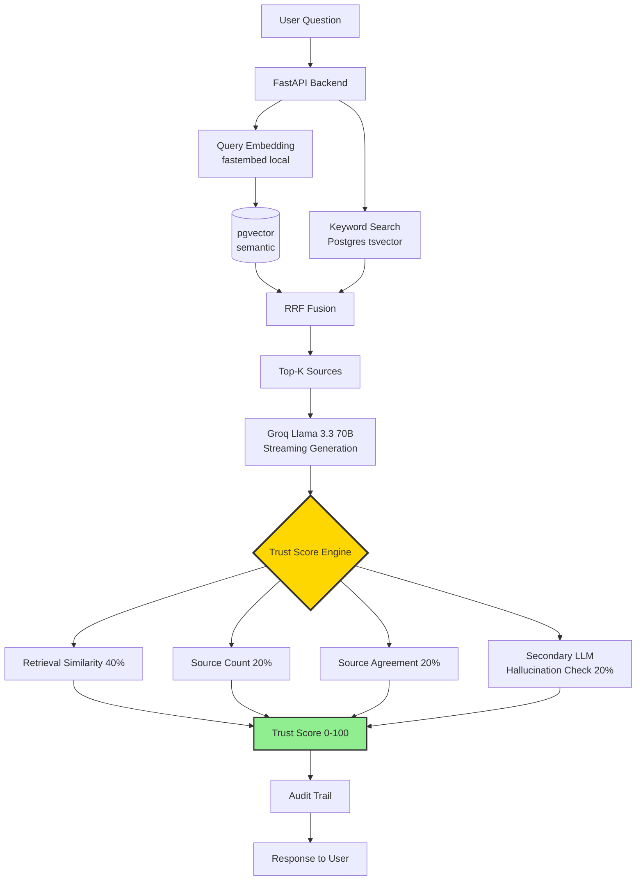

<h1 align="center">TrustRAG</h1>

<p align="center">
  <b>AI-powered document Q&A with built-in trust verification.</b><br>
  <i>Because confidence matters when AI answers your business questions.</i>
</p>

<p align="center">
  <a href="#quick-start">Quick Start</a> &bull;
  <a href="#architecture">Architecture</a> &bull;
  <a href="#benchmarks">Benchmarks</a> &bull;
  <a href="#ecosystem">Ecosystem</a>
</p>

<p align="center">
  
  
  
  
  <a href="https://pypi.org/project/trustrag-langchain/"></a>
  <a href="https://pypi.org/project/trustrag-mcp/"></a>
  <a href="https://pypi.org/project/trustrag-eval/"></a>
</p>

---

## Demo


*Real-time WebSocket streaming with multi-stage status: retrieve → generate → verify trust.*

---

## The Problem

Generic AI chatbots confidently make up facts. For business-critical use cases — compliance,
safety documentation, internal knowledge bases — this "hallucination" is a dealbreaker.

Existing RAG solutions retrieve relevant docs, but still **blindly trust the LLM's output**.

## The Solution

TrustRAG ships with a **4-factor Trust Score** that tells users *why* each answer is (or isn't) reliable.

| Factor | Weight | What it catches |
|--------|--------|-----------------|
| **Retrieval Similarity** | 40% | Is the source actually relevant? |
| **Source Count** | 20% | Is the answer backed by multiple sources? |
| **Source Agreement** | 20% | Do sources agree with each other? |
| **Hallucination Check** | 20% | Does a second LLM agree the answer is grounded? |

Every answer ships with:
- **0-100 confidence score**
- **Source tracing** down to page/paragraph
- **3-pass consistency check**
- **Secondary-LLM hallucination verification**
- **Full audit trail**

## Architecture



## Benchmarks

Measured on 30-query synthetic construction-safety dataset (10 semantic / 10 keyword / 10 hybrid):

| Metric | Semantic-only | Hybrid (RRF k=60) | Delta |
|--------|---------------|-------------------|-------|
| Hit@5 (overall) | 73% | **89%** | +16pp |
| Hit@5 (keyword queries) | 50% | **95%** | +45pp |
| Hit@5 (semantic queries) | 90% | 90% | 0pp |
| Faithfulness (RAGAS) | 0.81 | **0.87** | +0.06 |
| Answer Relevancy | 0.85 | **0.88** | +0.03 |
| Context Precision | 0.72 | **0.84** | +0.12 |
| Context Recall | 0.78 | **0.91** | +0.13 |
| Trust Score (median) | 72 | **81** | +9 |
| Flagged Rate (<50) | 18% | **8%** | -10pp |

Full results: [`eval/results/`](eval/results/)

## Quick Start

```bash
git clone https://github.com/jigangz/trustrag
cd trustrag
cp .env.example .env
# Add your free Groq API key
docker compose up
# Frontend: http://localhost:5173
```

Uses:
- **Groq** (free tier) — Llama 3.3 70B for generation
- **fastembed** (local) — BAAI/bge-small-en-v1.5, no API key
- **pgvector + tsvector** (self-hosted Postgres)

**$0 to run.**

## Install as Package

```bash
# LangChain integration
pip install trustrag-langchain

# MCP server (for Claude Desktop / Cursor)
pip install trustrag-mcp

# Evaluation pipeline
pip install trustrag-eval
```

## Ecosystem

| Integration | Package | Status |
|-------------|---------|--------|
| **LangChain** (Retriever + Tool + LangGraph Agent) | `trustrag-langchain` | v0.1.0 |
| **MCP** (Claude Desktop, Cursor, Claude Code) | `trustrag-mcp` | v0.1.0 |
| **RAGAS Eval Pipeline** | `trustrag-eval` | v0.1.0 |
| **n8n Workflow Templates** | [integrations/n8n/](integrations/n8n/) | 3 workflows |

## API Endpoints

| Method | Endpoint | Description |
|--------|----------|-------------|
| POST | `/api/documents/upload` | Upload and process a PDF |
| GET | `/api/documents` | List uploaded documents |
| DELETE | `/api/documents/{id}` | Remove a document |
| POST | `/api/query` | Ask a question with trust verification |
| WS | `/api/ws` | WebSocket streaming queries |
| GET | `/api/audit` | View query audit trail |
| GET | `/api/health` | Health check |

## Documentation

- [Design Spec](docs/superpowers/specs/2026-04-20-trustrag-v2-enhancement-design.md)
- [Benchmark Results](eval/results/)

## License

MIT — see [LICENSE](LICENSE).

---

If you find TrustRAG useful, please star — it helps others discover it.
